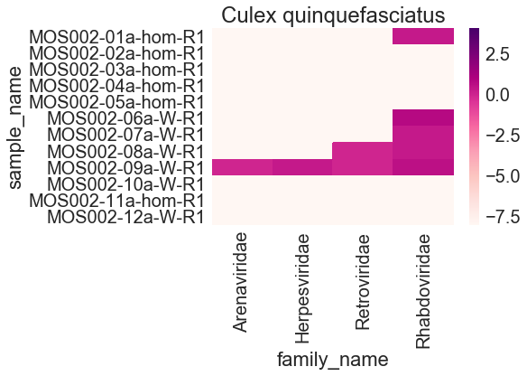
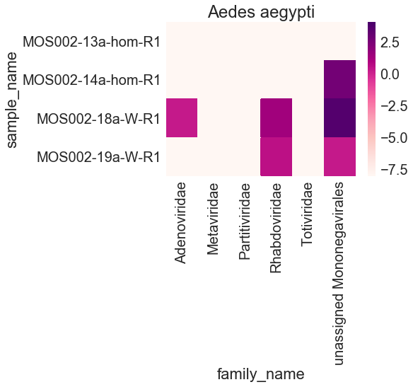
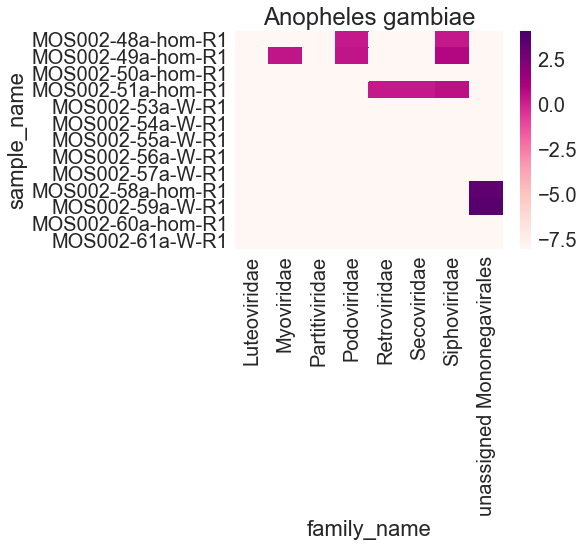
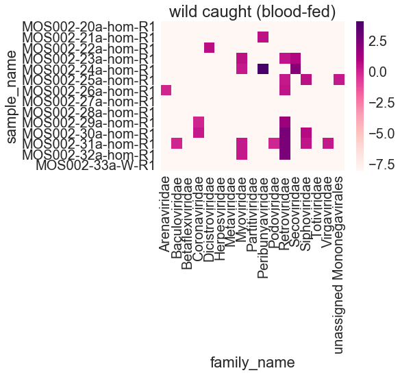
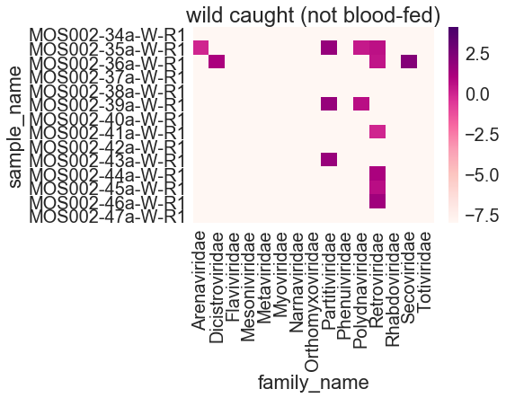

# Preliminary analysis of CDC pilot project


```python
import pandas as pd
from ete3 import NCBITaxa
import os
import seaborn
import matplotlib.pyplot as plt
import math
```

Download NCBI taxonomy database: 


```python
ncbi = NCBITaxa()
#ncbi.update_taxonomy_database()
```

Download table from IDseq containing number of reads mapping to each species.


```python
report_dir = "../../data/MOS002_reports"
sample_table_csv = "../../data/MOS002_sample-table.csv"
```


```python
sample_table = pd.read_csv(sample_table_csv)
```

## Reports


```python
report_csv = report_dir+"/"+sample_table.sample_name+"_report.csv"
reports = pd.concat([pd.read_csv(x).assign(sample_name=os.path.basename(x).replace("_report.csv", "")) for x in report_csv])
reports = pd.merge(reports, sample_table[['sample_name', 'total_reads', 'nonhost_reads', 'nonhost_reads_percent', 'ercc_reads', 'tissue_type', 'location', 'notes', 'sample_diagnosis']], how='left', on='sample_name')
```

    /Users/lucy.li/anaconda3/lib/python3.6/site-packages/ipykernel_launcher.py:2: FutureWarning: Sorting because non-concatenation axis is not aligned. A future version
    of pandas will change to not sort by default.
    
    To accept the future behavior, pass 'sort=True'.
    
    To retain the current behavior and silence the warning, pass sort=False
    
      


```python
bloodmeal_top_perc_id = reports[(reports.category_name=="Eukaryota") & (reports.tax_level==2)].groupby(['sample_name']).head(5).groupby(['sample_name']).agg({'NR_percentidentity':'max'}).rename({'NR_percentidentity':'max_NR_percentidentity'}, axis='columns')
bloodmeal_df = pd.merge(reports, bloodmeal_top_perc_id, how='left', on=['sample_name'])
bloodmeal_df[bloodmeal_df['NR_percentidentity']==bloodmeal_df['max_NR_percentidentity']].groupby(['sample_name']).head(1)[['sample_name', 'name', 'common_name', 'tax_id', 'location', 'notes', 'sample_diagnosis']]

```


<div>
<style scoped>
    .dataframe tbody tr th:only-of-type {
        vertical-align: middle;
    }

    .dataframe tbody tr th {
        vertical-align: top;
    }

    .dataframe thead th {
        text-align: right;
    }
</style>
<table border="1" class="dataframe">
  <thead>
    <tr style="text-align: right;">
      <th></th>
      <th>sample_name</th>
      <th>name</th>
      <th>common_name</th>
      <th>tax_id</th>
      <th>location</th>
      <th>notes</th>
      <th>sample_diagnosis</th>
    </tr>
  </thead>
  <tbody>
    <tr>
      <th>2</th>
      <td>MOS002-01a-hom-R1</td>
      <td>Anser</td>
      <td>geese</td>
      <td>8842</td>
      <td>lab</td>
      <td>- id_method : freeze\n- genus_species: Culex q...</td>
      <td>flavivirus spike-in</td>
    </tr>
    <tr>
      <th>898</th>
      <td>MOS002-02a-hom-R1</td>
      <td>Anser</td>
      <td>geese</td>
      <td>8842</td>
      <td>lab</td>
      <td>- id_method : freeze\n- genus_species: Culex q...</td>
      <td>flavivirus spike-in</td>
    </tr>
    <tr>
      <th>1553</th>
      <td>MOS002-03a-hom-R1</td>
      <td>Anser</td>
      <td>geese</td>
      <td>8842</td>
      <td>lab</td>
      <td>- id_method : freeze\n- genus_species: Culex q...</td>
      <td>flavivirus spike-in</td>
    </tr>
    <tr>
      <th>2190</th>
      <td>MOS002-04a-hom-R1</td>
      <td>Anser</td>
      <td>geese</td>
      <td>8842</td>
      <td>lab</td>
      <td>- id_method : freeze\n- genus_species: Culex q...</td>
      <td>flavivirus spike-in</td>
    </tr>
    <tr>
      <th>3105</th>
      <td>MOS002-05a-hom-R1</td>
      <td>Anser</td>
      <td>geese</td>
      <td>8842</td>
      <td>lab</td>
      <td>- id_method : freeze\n- genus_species: Culex q...</td>
      <td>flavivirus spike-in</td>
    </tr>
    <tr>
      <th>4012</th>
      <td>MOS002-06a-W-R1</td>
      <td>Non-genus-specific reads in family Anatidae</td>
      <td>NaN</td>
      <td>-200008830</td>
      <td>lab</td>
      <td>- id_method : freeze\n- genus_species: Culex q...</td>
      <td>NaN</td>
    </tr>
    <tr>
      <th>5485</th>
      <td>MOS002-07a-W-R1</td>
      <td>Anser</td>
      <td>geese</td>
      <td>8842</td>
      <td>lab</td>
      <td>- id_method : freeze\n- genus_species: Culex q...</td>
      <td>NaN</td>
    </tr>
    <tr>
      <th>6992</th>
      <td>MOS002-08a-W-R1</td>
      <td>Anser</td>
      <td>geese</td>
      <td>8842</td>
      <td>lab</td>
      <td>- id_method : freeze\n- genus_species: Culex q...</td>
      <td>NaN</td>
    </tr>
    <tr>
      <th>8365</th>
      <td>MOS002-09a-W-R1</td>
      <td>Non-genus-specific reads in family Anatidae</td>
      <td>NaN</td>
      <td>-200008830</td>
      <td>lab</td>
      <td>-collaborator id: Pilot18-009 \n- id_method : ...</td>
      <td>NaN</td>
    </tr>
    <tr>
      <th>10323</th>
      <td>MOS002-10a-W-R1</td>
      <td>Anser</td>
      <td>geese</td>
      <td>8842</td>
      <td>lab</td>
      <td>- id_method : freeze\n- genus_species: Culex q...</td>
      <td>NaN</td>
    </tr>
    <tr>
      <th>11456</th>
      <td>MOS002-11a-hom-R1</td>
      <td>Non-genus-specific reads in family Culicidae</td>
      <td>NaN</td>
      <td>-200007157</td>
      <td>lab</td>
      <td>- id_method : freeze\n- genus_species: Culex q...</td>
      <td>NaN</td>
    </tr>
    <tr>
      <th>11957</th>
      <td>MOS002-12a-W-R1</td>
      <td>Culex</td>
      <td>NaN</td>
      <td>7174</td>
      <td>lab</td>
      <td>- id_method : freeze\n- genus_species: Culex q...</td>
      <td>NaN</td>
    </tr>
    <tr>
      <th>12594</th>
      <td>MOS002-13a-hom-R1</td>
      <td>Capra</td>
      <td>NaN</td>
      <td>9922</td>
      <td>lab</td>
      <td>- id_method : freeze\n- genus_species: Aedes a...</td>
      <td>flavivirus spike-in</td>
    </tr>
    <tr>
      <th>12876</th>
      <td>MOS002-14a-hom-R1</td>
      <td>Ovis</td>
      <td>NaN</td>
      <td>9935</td>
      <td>lab</td>
      <td>- id_method : freeze\n- genus_species: Aedes a...</td>
      <td>flavivirus spike-in</td>
    </tr>
    <tr>
      <th>13141</th>
      <td>MOS002-15a-hom-R1</td>
      <td>Non-genus-specific reads in family Culicidae</td>
      <td>NaN</td>
      <td>-200007157</td>
      <td>wild-caught</td>
      <td>- id_method : freeze\n- genus_species: Psoroph...</td>
      <td>NaN</td>
    </tr>
    <tr>
      <th>13788</th>
      <td>MOS002-16a-hom-R1</td>
      <td>Pteropus</td>
      <td>NaN</td>
      <td>9401</td>
      <td>wild-caught</td>
      <td>- id_method : freeze\n- genus_species: Aedes a...</td>
      <td>NaN</td>
    </tr>
    <tr>
      <th>15316</th>
      <td>MOS002-17a-hom-R1</td>
      <td>Wolbachia endosymbiont of Drosophila simulans</td>
      <td>NaN</td>
      <td>77038</td>
      <td>wild-caught</td>
      <td>- id_method : freeze\n- genus_species: Culex q...</td>
      <td>NaN</td>
    </tr>
    <tr>
      <th>15805</th>
      <td>MOS002-18a-W-R1</td>
      <td>Non-genus-specific reads in family Bovidae</td>
      <td>NaN</td>
      <td>-200009895</td>
      <td>lab</td>
      <td>- id_method : freeze\n- genus_species: Aedes a...</td>
      <td>NaN</td>
    </tr>
    <tr>
      <th>16260</th>
      <td>MOS002-19a-W-R1</td>
      <td>Ovis</td>
      <td>NaN</td>
      <td>9935</td>
      <td>lab</td>
      <td>- id_method : freeze\n- genus_species: Aedes a...</td>
      <td>NaN</td>
    </tr>
    <tr>
      <th>17153</th>
      <td>MOS002-20a-hom-R1</td>
      <td>Homo</td>
      <td>NaN</td>
      <td>9605</td>
      <td>wild-caught</td>
      <td>- id_method : freeze\n- genus_species: Culex q...</td>
      <td>NaN</td>
    </tr>
    <tr>
      <th>18022</th>
      <td>MOS002-21a-hom-R1</td>
      <td>Manacus</td>
      <td>NaN</td>
      <td>196036</td>
      <td>wild-caught</td>
      <td>- id_method : freeze\n- genus_species: Culex q...</td>
      <td>NaN</td>
    </tr>
    <tr>
      <th>18834</th>
      <td>MOS002-22a-hom-R1</td>
      <td>Non-genus-specific reads in family Hominidae</td>
      <td>NaN</td>
      <td>-200009604</td>
      <td>wild-caught</td>
      <td>- id_method : freeze\n- genus_species: Culex q...</td>
      <td>NaN</td>
    </tr>
    <tr>
      <th>20865</th>
      <td>MOS002-23a-hom-R1</td>
      <td>Manacus</td>
      <td>NaN</td>
      <td>196036</td>
      <td>wild-caught</td>
      <td>- id_method : freeze\n- genus_species: Culex q...</td>
      <td>NaN</td>
    </tr>
    <tr>
      <th>22970</th>
      <td>MOS002-24a-hom-R1</td>
      <td>Manacus</td>
      <td>NaN</td>
      <td>196036</td>
      <td>wild-caught</td>
      <td>- id_method : freeze\n- genus_species: Culex q...</td>
      <td>NaN</td>
    </tr>
    <tr>
      <th>25049</th>
      <td>MOS002-25a-hom-R1</td>
      <td>Manacus</td>
      <td>NaN</td>
      <td>196036</td>
      <td>wild-caught</td>
      <td>- id_method : freeze\n- genus_species: Culex q...</td>
      <td>NaN</td>
    </tr>
    <tr>
      <th>26846</th>
      <td>MOS002-26a-hom-R1</td>
      <td>Manacus</td>
      <td>NaN</td>
      <td>196036</td>
      <td>wild-caught</td>
      <td>- id_method : freeze\n- genus_species: Culex q...</td>
      <td>NaN</td>
    </tr>
    <tr>
      <th>28078</th>
      <td>MOS002-27a-hom-R1</td>
      <td>Ficedula</td>
      <td>NaN</td>
      <td>36292</td>
      <td>wild-caught</td>
      <td>- id_method : freeze\n- genus_species: Culex q...</td>
      <td>NaN</td>
    </tr>
    <tr>
      <th>28833</th>
      <td>MOS002-28a-hom-R1</td>
      <td>Manacus</td>
      <td>NaN</td>
      <td>196036</td>
      <td>wild-caught</td>
      <td>- id_method : freeze\n- genus_species: Culex q...</td>
      <td>NaN</td>
    </tr>
    <tr>
      <th>29742</th>
      <td>MOS002-29a-hom-R1</td>
      <td>Gallus</td>
      <td>NaN</td>
      <td>9030</td>
      <td>wild-caught</td>
      <td>- id_method : freeze\n- genus_species: Culex q...</td>
      <td>NaN</td>
    </tr>
    <tr>
      <th>31859</th>
      <td>MOS002-30a-hom-R1</td>
      <td>Gallus</td>
      <td>NaN</td>
      <td>9030</td>
      <td>wild-caught</td>
      <td>- id_method : freeze\n- genus_species: Culex q...</td>
      <td>NaN</td>
    </tr>
    <tr>
      <th>...</th>
      <td>...</td>
      <td>...</td>
      <td>...</td>
      <td>...</td>
      <td>...</td>
      <td>...</td>
      <td>...</td>
    </tr>
    <tr>
      <th>37830</th>
      <td>MOS002-32a-hom-R1</td>
      <td>Gallus</td>
      <td>NaN</td>
      <td>9030</td>
      <td>wild-caught</td>
      <td>- id_method : freeze\n- genus_species: Culex q...</td>
      <td>NaN</td>
    </tr>
    <tr>
      <th>40923</th>
      <td>MOS002-33a-W-R1</td>
      <td>Non-genus-specific reads in family Culicidae</td>
      <td>NaN</td>
      <td>-200007157</td>
      <td>wild-caught</td>
      <td>- id_method : freeze\n- genus_species: Culex q...</td>
      <td>NaN</td>
    </tr>
    <tr>
      <th>41755</th>
      <td>MOS002-34a-W-R1</td>
      <td>Equus</td>
      <td>NaN</td>
      <td>9789</td>
      <td>wild-caught</td>
      <td>- id_method : freeze\n- genus_species: Aedes v...</td>
      <td>NaN</td>
    </tr>
    <tr>
      <th>42455</th>
      <td>MOS002-35a-W-R1</td>
      <td>Monodelphis</td>
      <td>short-tailed opossums</td>
      <td>13615</td>
      <td>wild-caught</td>
      <td>- id_method : freeze\n- genus_species: Anophel...</td>
      <td>NaN</td>
    </tr>
    <tr>
      <th>43259</th>
      <td>MOS002-36a-W-R1</td>
      <td>Monodelphis</td>
      <td>short-tailed opossums</td>
      <td>13615</td>
      <td>wild-caught</td>
      <td>- id_method : freeze\n- genus_species: Culex q...</td>
      <td>NaN</td>
    </tr>
    <tr>
      <th>44172</th>
      <td>MOS002-37a-W-R1</td>
      <td>Ochlerotatus</td>
      <td>NaN</td>
      <td>190765</td>
      <td>wild-caught</td>
      <td>- id_method : freeze\n- genus_species: Aedes a...</td>
      <td>NaN</td>
    </tr>
    <tr>
      <th>44728</th>
      <td>MOS002-38a-W-R1</td>
      <td>Non-genus-specific reads in family Culicidae</td>
      <td>NaN</td>
      <td>-200007157</td>
      <td>wild-caught</td>
      <td>- id_method : freeze\n- genus_species: Psoroph...</td>
      <td>NaN</td>
    </tr>
    <tr>
      <th>45455</th>
      <td>MOS002-39a-W-R1</td>
      <td>Monodelphis</td>
      <td>short-tailed opossums</td>
      <td>13615</td>
      <td>wild-caught</td>
      <td>- id_method : freeze\n- genus_species: Psoroph...</td>
      <td>NaN</td>
    </tr>
    <tr>
      <th>46171</th>
      <td>MOS002-40a-W-R1</td>
      <td>Psorophora</td>
      <td>NaN</td>
      <td>7182</td>
      <td>wild-caught</td>
      <td>- id_method : freeze\n- genus_species: Psoroph...</td>
      <td>NaN</td>
    </tr>
    <tr>
      <th>47145</th>
      <td>MOS002-41a-W-R1</td>
      <td>Quercus</td>
      <td>NaN</td>
      <td>3511</td>
      <td>wild-caught</td>
      <td>- id_method : freeze\n- genus_species: Aedes v...</td>
      <td>NaN</td>
    </tr>
    <tr>
      <th>48131</th>
      <td>MOS002-42a-W-R1</td>
      <td>Trypanosoma</td>
      <td>NaN</td>
      <td>5690</td>
      <td>wild-caught</td>
      <td>- id_method : freeze\n- genus_species: Anophel...</td>
      <td>NaN</td>
    </tr>
    <tr>
      <th>49148</th>
      <td>MOS002-43a-W-R1</td>
      <td>Anopheles</td>
      <td>NaN</td>
      <td>7164</td>
      <td>wild-caught</td>
      <td>- id_method : freeze\n- genus_species: Culiset...</td>
      <td>NaN</td>
    </tr>
    <tr>
      <th>49793</th>
      <td>MOS002-44a-W-R1</td>
      <td>Gallus</td>
      <td>NaN</td>
      <td>9030</td>
      <td>wild-caught</td>
      <td>- id_method : freeze\n- genus_species: Culex q...</td>
      <td>NaN</td>
    </tr>
    <tr>
      <th>50769</th>
      <td>MOS002-45a-W-R1</td>
      <td>Gallus</td>
      <td>NaN</td>
      <td>9030</td>
      <td>wild-caught</td>
      <td>- id_method : freeze\n- genus_species: Culex q...</td>
      <td>NaN</td>
    </tr>
    <tr>
      <th>51702</th>
      <td>MOS002-46a-W-R1</td>
      <td>Gallus</td>
      <td>NaN</td>
      <td>9030</td>
      <td>wild-caught</td>
      <td>- id_method : freeze\n- genus_species: Culex q...</td>
      <td>NaN</td>
    </tr>
    <tr>
      <th>52951</th>
      <td>MOS002-47a-W-R1</td>
      <td>Gallus</td>
      <td>NaN</td>
      <td>9030</td>
      <td>wild-caught</td>
      <td>- id_method : freeze\n- genus_species: Culex q...</td>
      <td>NaN</td>
    </tr>
    <tr>
      <th>54102</th>
      <td>MOS002-48a-hom-R1</td>
      <td>Bos mutus</td>
      <td>wild yak</td>
      <td>72004</td>
      <td>lab</td>
      <td>- id_method : freeze\n- genus_species: Anophel...</td>
      <td>blinded flavivirus spike-in</td>
    </tr>
    <tr>
      <th>55814</th>
      <td>MOS002-49a-hom-R1</td>
      <td>Beauveria</td>
      <td>NaN</td>
      <td>5581</td>
      <td>lab</td>
      <td>- id_method : freeze\n- genus_species: Anophel...</td>
      <td>blinded flavivirus spike-in</td>
    </tr>
    <tr>
      <th>60265</th>
      <td>MOS002-50a-hom-R1</td>
      <td>Non-genus-specific reads in family Hominidae</td>
      <td>NaN</td>
      <td>-200009604</td>
      <td>lab</td>
      <td>- id_method : freeze\n- genus_species: Anophel...</td>
      <td>blinded flavivirus spike-in</td>
    </tr>
    <tr>
      <th>61447</th>
      <td>MOS002-51a-hom-R1</td>
      <td>Bos</td>
      <td>"oxen</td>
      <td>9903</td>
      <td>lab</td>
      <td>- id_method : freeze\n- genus_species: Anophel...</td>
      <td>blinded flavivirus spike-in</td>
    </tr>
    <tr>
      <th>64784</th>
      <td>MOS002-53a-W-R1</td>
      <td>Bos mutus</td>
      <td>wild yak</td>
      <td>72004</td>
      <td>lab</td>
      <td>- id_method : freeze\n- genus_species: Anophel...</td>
      <td>NaN</td>
    </tr>
    <tr>
      <th>64938</th>
      <td>MOS002-54a-W-R1</td>
      <td>Bos</td>
      <td>"oxen</td>
      <td>9903</td>
      <td>lab</td>
      <td>- id_method : freeze\n- genus_species: Anophel...</td>
      <td>NaN</td>
    </tr>
    <tr>
      <th>65921</th>
      <td>MOS002-55a-W-R1</td>
      <td>Bos</td>
      <td>"oxen</td>
      <td>9903</td>
      <td>lab</td>
      <td>- id_method : freeze\n- genus_species: Anophel...</td>
      <td>NaN</td>
    </tr>
    <tr>
      <th>66340</th>
      <td>MOS002-56a-W-R1</td>
      <td>Bos</td>
      <td>"oxen</td>
      <td>9903</td>
      <td>lab</td>
      <td>- id_method : freeze\n- genus_species: Anophel...</td>
      <td>NaN</td>
    </tr>
    <tr>
      <th>66626</th>
      <td>MOS002-57a-W-R1</td>
      <td>Bos</td>
      <td>"oxen</td>
      <td>9903</td>
      <td>lab</td>
      <td>- id_method : freeze\n- genus_species: Anophel...</td>
      <td>NaN</td>
    </tr>
    <tr>
      <th>67005</th>
      <td>MOS002-58a-hom-R1</td>
      <td>Non-genus-specific reads in family Culicidae</td>
      <td>NaN</td>
      <td>-200007157</td>
      <td>lab</td>
      <td>- id_method : freeze\n- genus_species: Aedes a...</td>
      <td>1 flavivirus mosquito spiked-in to pool</td>
    </tr>
    <tr>
      <th>67815</th>
      <td>MOS002-59a-W-R1</td>
      <td>Tsukamurella</td>
      <td>NaN</td>
      <td>2060</td>
      <td>lab</td>
      <td>- id_method : freeze\n- genus_species: Aedes a...</td>
      <td>1 flavivirus mosquito spiked-in to pool</td>
    </tr>
    <tr>
      <th>68494</th>
      <td>MOS002-60a-hom-R1</td>
      <td>Non-genus-specific reads in family Neocallimas...</td>
      <td>NaN</td>
      <td>-200029007</td>
      <td>lab</td>
      <td>- id_method : freeze\n- genus_species: Anophel...</td>
      <td>1 flavivirus mosquito spiked-in to pool</td>
    </tr>
    <tr>
      <th>69251</th>
      <td>MOS002-61a-W-R1</td>
      <td>Non-genus-specific reads in family Neocallimas...</td>
      <td>NaN</td>
      <td>-200029007</td>
      <td>lab</td>
      <td>- id_method : freeze\n- genus_species: Anophel...</td>
      <td>1 flavivirus mosquito spiked-in to pool</td>
    </tr>
    <tr>
      <th>69930</th>
      <td>MOS002-62a-Water-R1</td>
      <td>Non-genus-specific reads in family Hominidae</td>
      <td>NaN</td>
      <td>-200009604</td>
      <td>NaN</td>
      <td>NaN</td>
      <td>NaN</td>
    </tr>
  </tbody>
</table>
<p>61 rows × 7 columns</p>
</div>


```python
reports_viruses = reports[(reports.category_name=="Viruses") & (reports.tax_level==2)]
```


```python
NT_r_family = reports_viruses.groupby(['sample_name', 'family_taxid'])['NT_r'].sum().to_frame()
NT_r_family = NT_r_family.reset_index(level=0).reset_index(level=0)
family_dict = ncbi.get_taxid_translator(NT_r_family.family_taxid.tolist())
NT_r_family['family_name'] = NT_r_family.family_taxid.apply(lambda x: family_dict[x] if x>0 else 'unassigned Mononegavirales')
for x in sample_table.sample_name:
    if (not NT_r_family.sample_name.str.contains(x).any()):
        dict_to_add = {'family_taxid': "none found", 'sample_name': x, 'NT_r': 0.0, 'family_name': "none found"}
        NT_r_family = NT_r_family.append(dict_to_add, ignore_index=True)
NT_r_family.sort_values(by='sample_name', axis=0, inplace=True)
NT_r_family = NT_r_family[['sample_name', 'family_name', 'NT_r']].groupby(['sample_name', 'family_name'])['NT_r'].sum().to_frame().reset_index(level=0).reset_index(level=0)
```


```python
NT_r_family.head()
```


<div>
<style scoped>
    .dataframe tbody tr th:only-of-type {
        vertical-align: middle;
    }

    .dataframe tbody tr th {
        vertical-align: top;
    }

    .dataframe thead th {
        text-align: right;
    }
</style>
<table border="1" class="dataframe">
  <thead>
    <tr style="text-align: right;">
      <th></th>
      <th>family_name</th>
      <th>sample_name</th>
      <th>NT_r</th>
    </tr>
  </thead>
  <tbody>
    <tr>
      <th>0</th>
      <td>Herpesviridae</td>
      <td>MOS002-01a-hom-R1</td>
      <td>0.0</td>
    </tr>
    <tr>
      <th>1</th>
      <td>Rhabdoviridae</td>
      <td>MOS002-01a-hom-R1</td>
      <td>2.0</td>
    </tr>
    <tr>
      <th>2</th>
      <td>none found</td>
      <td>MOS002-02a-hom-R1</td>
      <td>0.0</td>
    </tr>
    <tr>
      <th>3</th>
      <td>none found</td>
      <td>MOS002-03a-hom-R1</td>
      <td>0.0</td>
    </tr>
    <tr>
      <th>4</th>
      <td>Herpesviridae</td>
      <td>MOS002-04a-hom-R1</td>
      <td>0.0</td>
    </tr>
  </tbody>
</table>
</div>


## Plotting heatmap of viruses


```python
def plot_heatmap (df, title='', vmin=math.log10(0.00000001), vmax=math.log10(NT_r_family.NT_r.max())):
    df = pd.pivot_table(df, values='NT_r', index=['sample_name'], columns=["family_name"]).fillna(0)
    df = df.applymap(lambda x: math.log10(x+0.00000001))
    if ('none found' in df.columns):
        df = df.drop('none found', axis=1)
    seaborn.set(style="whitegrid", font_scale=2)
    ax = seaborn.heatmap(data=df, vmin=vmin, vmax=vmax, cmap="RdPu", xticklabels=True, yticklabels=True)
    ax.set_title(title)

```


```python
culex_quing_virus_df = NT_r_family[:NT_r_family.loc[NT_r_family.sample_name.str.contains('13a')].index[0]]
plot_heatmap (culex_quing_virus_df, title="Culex quinquefasciatus")
```





```python
aedes_aegypti_virus_df = NT_r_family.loc[NT_r_family.sample_name.str.contains('1[3-48-9]a', regex=True)]
plot_heatmap (aedes_aegypti_virus_df, title="Aedes aegypti")
```





```python
anopheles_gambiae_virus_df = NT_r_family.loc[NT_r_family.sample_name.str.contains('4[8-9]a|5[0-1|3-9]a|6[0|1]a', regex=True)]
anopheles_gambiae_virus_df
plot_heatmap (anopheles_gambiae_virus_df, title="Anopheles gambiae")

```





```python
wild_bloodfed_df = NT_r_family.loc[NT_r_family.sample_name.str.contains('2[0-9]a|3[0-3]a', regex=True)]
plot_heatmap (wild_bloodfed_df, title="wild caught (blood-fed)")
```





```python
wild_nonbloodfed_df = NT_r_family.loc[NT_r_family.sample_name.str.contains('3[4-9]a|4[0-7]a', regex=True)]
plot_heatmap (wild_nonbloodfed_df, title="wild caught (not blood-fed)")
```




