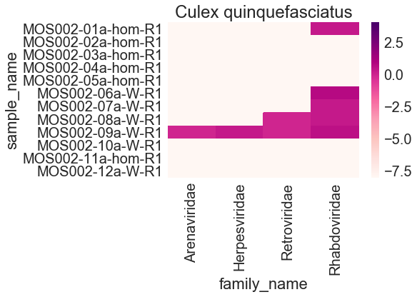
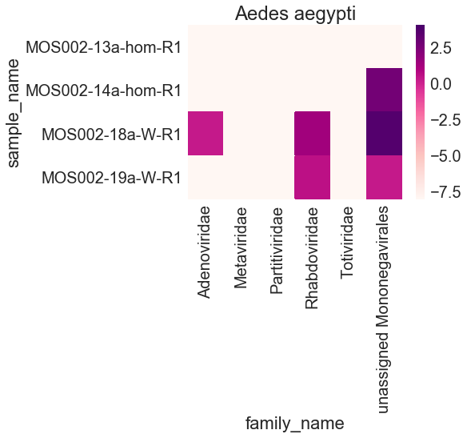
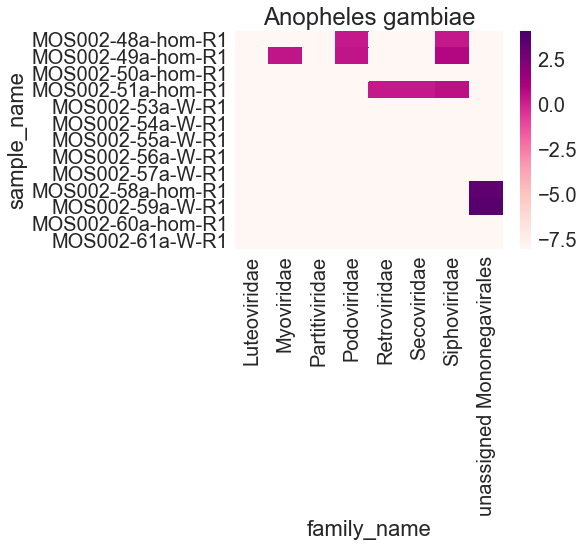
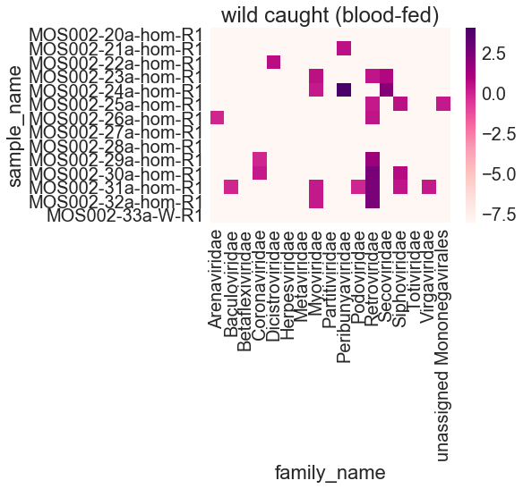

# Preliminary analysis of CDC pilot project


```python
import pandas as pd
from ete3 import NCBITaxa
import os
import seaborn
import matplotlib.pyplot as plt
import math
```

Download NCBI taxonomy database: 


```python
ncbi = NCBITaxa()
ncbi.update_taxonomy_database()
```

    Downloading taxdump.tar.gz from NCBI FTP site (via HTTP)...
    Done. Parsing...


    Loading node names...
    1934824 names loaded.
    205002 synonyms loaded.
    Loading nodes...
    1934824 nodes loaded.
    Linking nodes...
    Tree is loaded.
    Updating database: /Users/lucy.li/.etetoolkit/taxa.sqlite ...
     1934000 generating entries... 1568000 generating entries... 
    Uploading to /Users/lucy.li/.etetoolkit/taxa.sqlite


    Inserting synonyms:      30000 

    


    Inserting taxids:           0   

    
    


    Inserting taxids:       1930000 

    


Download table from IDseq containing number of reads mapping to each species.


```python
report_dir = "../../data/MOS002_reports"
sample_table_csv = "../../data/MOS002_sample-table.csv"
```


```python
sample_table = pd.read_csv(sample_table_csv)
```


```python
report_csv = report_dir+"/"+sample_table.sample_name+"_report.csv"
reports = pd.concat([pd.read_csv(x).assign(sample_name=os.path.basename(x).replace("_report.csv", "")) for x in report_csv])
reports_viruses = reports[(reports.category_name=="Viruses") & (reports.tax_level==2)]

```

    /Users/lucy.li/anaconda3/lib/python3.6/site-packages/ipykernel_launcher.py:2: FutureWarning: Sorting because non-concatenation axis is not aligned. A future version
    of pandas will change to not sort by default.
    
    To accept the future behavior, pass 'sort=True'.
    
    To retain the current behavior and silence the warning, pass sort=False
    
      


```python
NT_r_family = reports_viruses.groupby(['sample_name', 'family_taxid'])['NT_r'].sum().to_frame()
NT_r_family = NT_r_family.reset_index(level=0).reset_index(level=0)
family_dict = ncbi.get_taxid_translator(NT_r_family.family_taxid.tolist())
NT_r_family['family_name'] = NT_r_family.family_taxid.apply(lambda x: family_dict[x] if x>0 else 'unassigned Mononegavirales')
for x in sample_table.sample_name:
    if (not NT_r_family.sample_name.str.contains(x).any()):
        dict_to_add = {'family_taxid': "none found", 'sample_name': x, 'NT_r': 0.0, 'family_name': "none found"}
        NT_r_family = NT_r_family.append(dict_to_add, ignore_index=True)
NT_r_family.sort_values(by='sample_name', axis=0, inplace=True)
NT_r_family = NT_r_family[['sample_name', 'family_name', 'NT_r']].groupby(['sample_name', 'family_name'])['NT_r'].sum().to_frame().reset_index(level=0).reset_index(level=0)
```


```python
NT_r_family.head()
```


<div>
<style scoped>
    .dataframe tbody tr th:only-of-type {
        vertical-align: middle;
    }

    .dataframe tbody tr th {
        vertical-align: top;
    }

    .dataframe thead th {
        text-align: right;
    }
</style>
<table border="1" class="dataframe">
  <thead>
    <tr style="text-align: right;">
      <th></th>
      <th>family_name</th>
      <th>sample_name</th>
      <th>NT_r</th>
    </tr>
  </thead>
  <tbody>
    <tr>
      <th>0</th>
      <td>Herpesviridae</td>
      <td>MOS002-01a-hom-R1</td>
      <td>0.0</td>
    </tr>
    <tr>
      <th>1</th>
      <td>Rhabdoviridae</td>
      <td>MOS002-01a-hom-R1</td>
      <td>2.0</td>
    </tr>
    <tr>
      <th>2</th>
      <td>none found</td>
      <td>MOS002-02a-hom-R1</td>
      <td>0.0</td>
    </tr>
    <tr>
      <th>3</th>
      <td>none found</td>
      <td>MOS002-03a-hom-R1</td>
      <td>0.0</td>
    </tr>
    <tr>
      <th>4</th>
      <td>Herpesviridae</td>
      <td>MOS002-04a-hom-R1</td>
      <td>0.0</td>
    </tr>
  </tbody>
</table>
</div>


```python
def plot_heatmap (df, title='', vmin=math.log10(0.00000001), vmax=math.log10(NT_r_family.NT_r.max())):
    df = pd.pivot_table(df, values='NT_r', index=['sample_name'], columns=["family_name"]).fillna(0)
    df = df.applymap(lambda x: math.log10(x+0.00000001))
    if ('none found' in df.columns):
        df = df.drop('none found', axis=1)
    seaborn.set(style="whitegrid", font_scale=2)
    ax = seaborn.heatmap(data=df, vmin=vmin, vmax=vmax, cmap="RdPu", xticklabels=True, yticklabels=True)
    ax.set_title(title)

```


```python
culex_quing_virus_df = NT_r_family[:NT_r_family.loc[NT_r_family.sample_name.str.contains('13a')].index[0]]
plot_heatmap (culex_quing_virus_df, title="Culex quinquefasciatus")
```





```python
aedes_aegypti_virus_df = NT_r_family.loc[NT_r_family.sample_name.str.contains('1[3-48-9]a', regex=True)]
plot_heatmap (aedes_aegypti_virus_df, title="Aedes aegypti")
```





```python
anopheles_gambiae_virus_df = NT_r_family.loc[NT_r_family.sample_name.str.contains('4[8-9]a|5[0-1|3-9]a|6[0|1]a', regex=True)]
anopheles_gambiae_virus_df
plot_heatmap (anopheles_gambiae_virus_df, title="Anopheles gambiae")

```





```python
wild_bloodfed_df = NT_r_family.loc[NT_r_family.sample_name.str.contains('2[0-9]a|3[0-3]a', regex=True)]
plot_heatmap (wild_bloodfed_df, title="wild caught (blood-fed)")
```





```python
wild_nonbloodfed_df = NT_r_family.loc[NT_r_family.sample_name.str.contains('3[4-9]a|4[0-7]a', regex=True)]
plot_heatmap (wild_nonbloodfed_df, title="wild caught (not blood-fed)")
```


